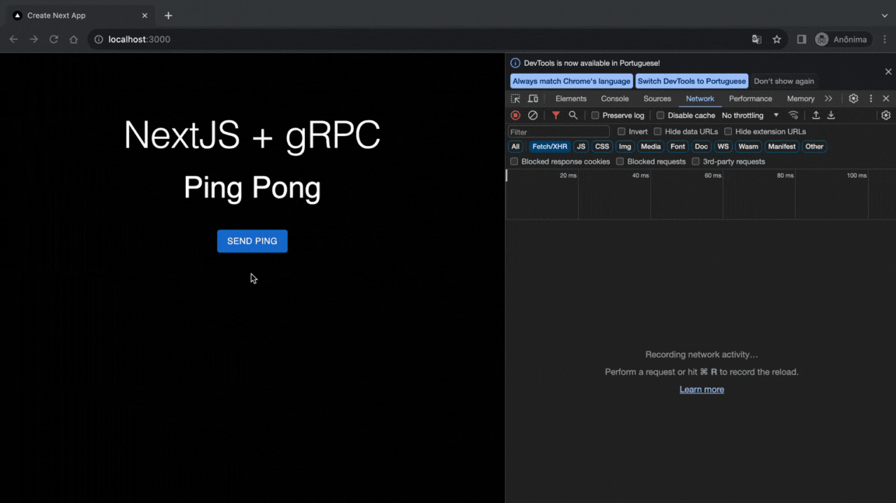

# Teste Ping Pong - NextJS + gRPC

<div align="center">
  
</div>

Foi baseado em um tutorial feito para o React + gRPC: https://morioh.com/a/ae48b33d10a0/how-to-use-grpc-web-with-react

## Requisitos

- [protoc](https://grpc.io/docs/protoc-installation/)
- [npm](https://www.npmjs.com/)
- [node](https://nodejs.org/en)

## Rodando localmente

### Frontend

```
 npm i
```

```
 npm run dev
```

### Backend

```
 node server.js
```

### Proxy Envoy

```
 docker pull envoyproxy/envoy:v1.18-latest
```

```
 docker run --name my-envoy -p 9901:9901 -p 8080:8080 -v $(pwd)/envoy.yaml:/etc/envoy/envoy.yaml envoyproxy/envoy:v1.18-latest
```

## O que foi feito?

1. Instalado as depenência para o uso do gRPC no Next. Elas estão listadas no package.json.

2. Criado o contrato com o arquivo pinpong.proto na pasta src/proto contendo todas as definições de interface messages e services.

3. Instalado o compilador protoc no notebook para criar os stubs(objetos que fornecem os os métodos remotos de conexão com a API)

4. Para garantir que o os stubs fossem criados em typescript foi necessário instalar o ts-protoc-gen e seguir os seguintes passos rodando os comandos no terminal:

   ```
     npm install -g protoc-gen-js
   ```

   ```
     PROTOC_GEN_TS_PATH="./node_modules/.bin/protoc-gen-ts
   ```

   ```
     OUT_DIR="./src/services"
   ```

   ```
       protoc -I=./src/proto --plugin="protoc-gen-ts=${PROTOC_GEN_TS_PATH}" \
       --js_out="import_style=commonjs,binary:${OUT_DIR}" \
       --ts_out="service=grpc-web:${OUT_DIR}" \
       pingpong.proto --ts_out=service=grpc-web:.
   ```

5. Foi implementada a conexão com o backend no page.tsx na pasta src/app.

6. Para criar um servidor básico e rodar localmente foi usado um script do server.js

7. Para transcodificar o gRPC-web em gRPC usado no backend, foi usado a Proxy Envoy, recebendo as requisições pela porta 8080 e as enviando para 9090 onde roda o servidor do back. Isso usando o docker.
